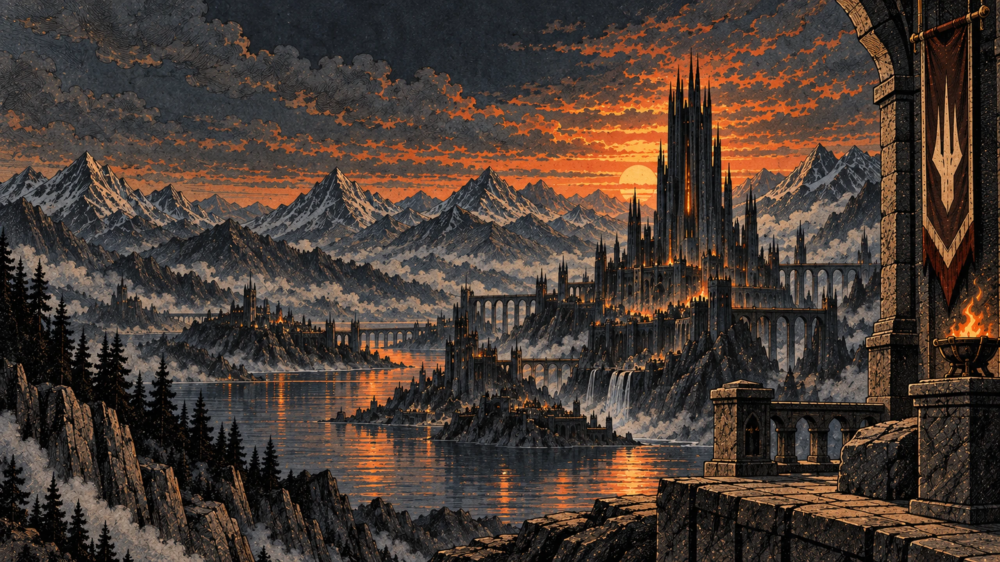
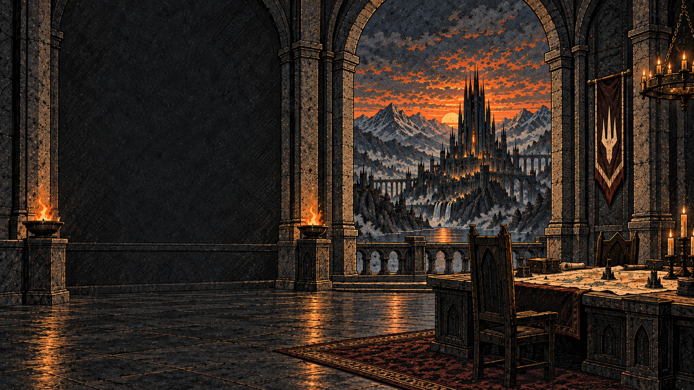
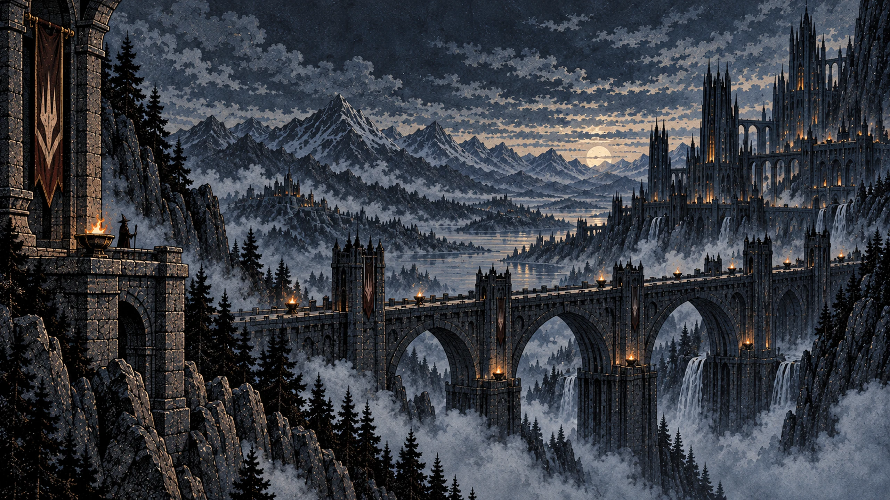
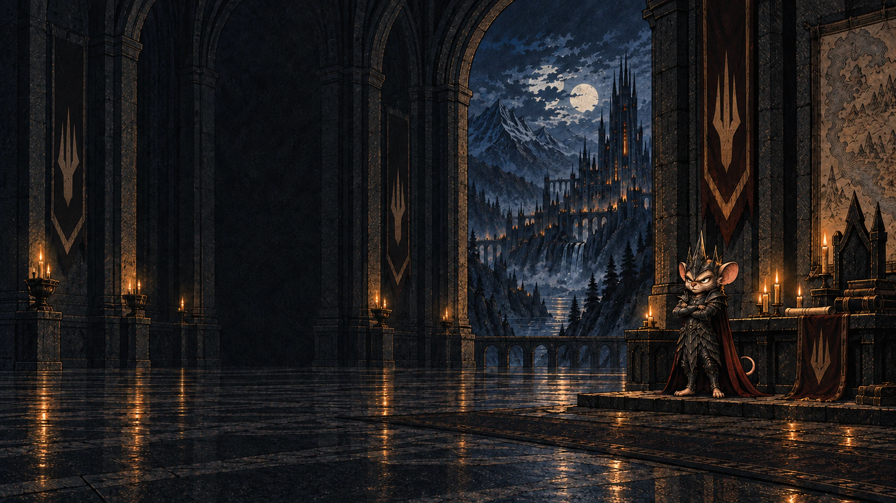
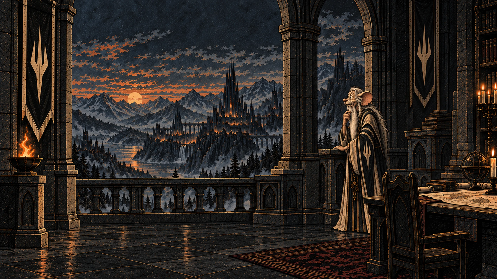
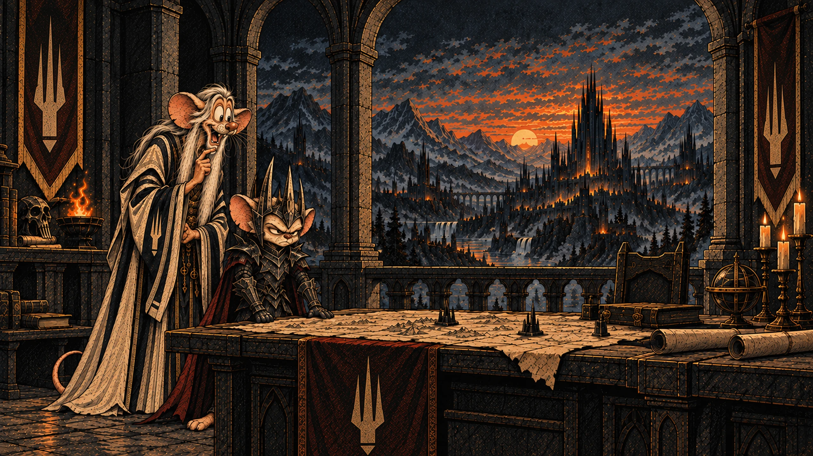
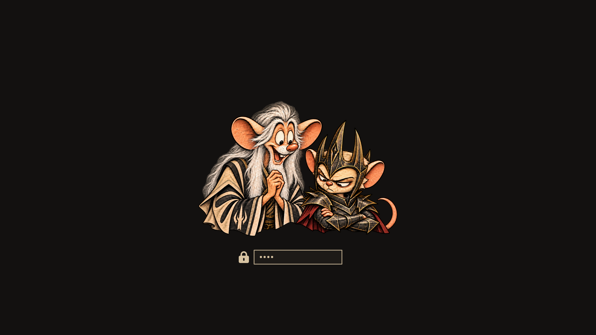

# Spire for Omarchy

Spire is a dark editorial-fantasy theme for Omarchy, built around warm ink-black surfaces, parchment text, restrained bronze accents, ember highlights, and smoke-blue counterpoints.

It stays deliberately close to Omarchy's native theming model: one complete semantic palette, one small lock-screen color override, and a curated wallpaper set. There are no scripts, hooks, custom shell widgets, compositor logic, terminal configs, or other executable extras.


## Requirements

- Omarchy 4.0+ / Quattro

## Install

```bash
omarchy theme install https://github.com/netseeker/omarchy-spire-theme
```

Then select **Spire** from the Omarchy theme switcher.

For local testing:

```bash
rm -rf ~/.config/omarchy/themes/spire
mkdir -p ~/.config/omarchy/themes/spire

cp -a \
  colors.toml \
  shell.lock.toml \
  icons.theme \
  preview.png \
  unlock.png \
  preview-unlock.png \
  backgrounds \
  ~/.config/omarchy/themes/spire/

omarchy theme set spire
```

## Included wallpapers

Spire ships with six 16:9 backgrounds:

Click any wallpaper to view it full size.

| | |
|---|---|
| [](backgrounds/01-spire.webp) | [](backgrounds/02-hall.webp) |
| **01 · Spire** | **02 · Hall** |
| [](backgrounds/03-crossing.webp) | [](backgrounds/04-the-watch.webp) |
| **03 · Crossing** | **04 · The Watch** |
| [](backgrounds/05-the-advisor.webp) | [](backgrounds/06-the-conspirators.webp) |
| **05 · The Advisor** | **06 · The Conspirators** |

The first four form the quieter core set. The last two are more character-focused bonus backgrounds.

## Palette

| Role | Color |
| --- | --- |
| Background | `#131110` |
| Elevated surface | `#221E19` |
| Foreground | `#D8C4A2` |
| Muted text | `#887A68` |
| Light foreground | `#E2CAA6` |
| Bright foreground | `#F0D7AF` |
| Accent | `#A38659` |
| Gold | `#D5A16D` |
| Ember | `#C87455` |
| Green | `#87946A` |
| Smoke cyan | `#8EA7AB` |
| Smoke blue | `#72899C` |

## Design intent

- Warm black instead of neutral black
- Parchment text instead of stark white
- Bronze as the everyday accent; brighter gold reserved for highlights
- Cool cyan and blue retained for editor and terminal readability
- A restrained bronze active-border gradient rather than a bright gold frame on every surface
- No full `shell.toml`; Spire inherits current Omarchy shell defaults
- Only the lock section is overridden, keeping the password field aligned with the palette
- Original Spire emblem used consistently across the wallpaper set

## Behind Spire

Spire grew out of the visual language developed for our daily editorial-fantasy satire. The recurring Advisor and Strategist in several wallpapers come from that same world.

Follow the project on X: [@EvilLOTRNews](https://x.com/EvilLOTRNews)

## Lock screen

Spire keeps Omarchy's standard blurred active-wallpaper session lock screen.
The theme only adjusts the password-field colors via `shell.lock.toml`.

## Boot unlock

Spire includes a custom Plymouth/LUKS boot-unlock illustration.

<p align="center">
  
</p>

After installing Spire, select it separately under **Style → Unlock**.
Omarchy keeps the desktop theme and boot-unlock theme selections independent.

The unlock artwork is provided by `unlock.png`; `preview-unlock.png`
is used by Omarchy's unlock-theme selector.

## Files

- `colors.toml` — complete semantic palette used by Omarchy's generated themes
- `shell.lock.toml` — lock-screen password-field color override
- `icons.theme` — warm brown Yaru icon variant matching Spire's bronze palette
- `unlock.png` — custom Plymouth/LUKS boot-unlock artwork
- `preview-unlock.png` — Omarchy preview for Style → Unlock
- `backgrounds/` — six curated wallpapers
- `preview.png` — real Omarchy desktop preview
- `CONTRAST.md` — contrast notes for the final palette
- `LICENSE` — licensing for configuration, documentation, and artwork
- `RELEASE_NOTES.md` — release notes

## License

Configuration and documentation are licensed under the MIT License.

Artwork is made available under CC BY-NC 4.0 to the extent the contributors hold the relevant rights. See `LICENSE` for details.
